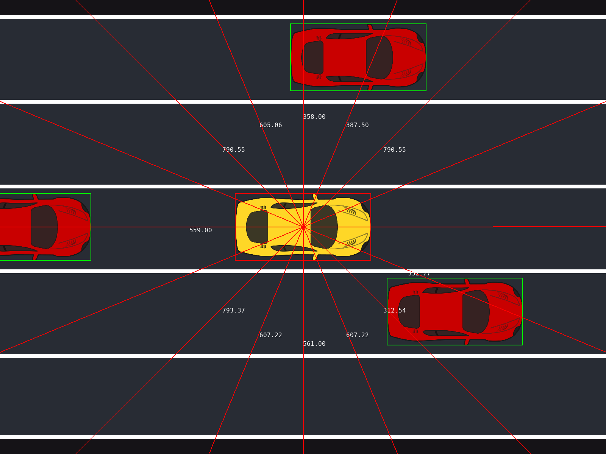
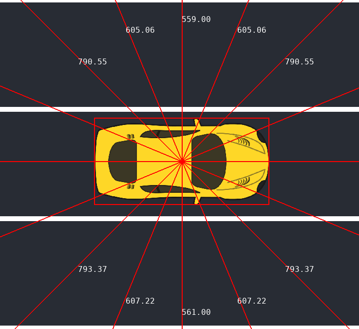

# Race Car

🔴 Ready

🟡 Set

🟢 GO! 

🏁 It's racing time! 🏁 

Race against the competition to go the furthest in the allotted time, but be careful, one small crash can end your run!



## About the game
You control the yellow car. Red and blue cars will spawn in random lanes - it is your job to dodge them. The car is equipped with 8 evenly spaced sensors - each being able to find obstacles within a 1000px. Figure 2 shows an image of the sensors with names.

Each tick the game is updated. The game runs with 60 ticks per second. A list stores future actions, and each tick, an action is popped from the list and applied to the car. If there are no actions in the list, it will repeat the last action. If there is no last action, it will default to 'NOTHING'. 

A game runs for up to 60 seconds - 3600 ticks. If you crash, the game will immediately end. Once the game ends, the final score will be the distance you achieved. 

### Environment
The game runs with 5 lanes of equal size. Your car will spawn in the center lane, while other cars will spawn randomly in other lanes. The other cars will not leave their lane, and only one other car can be in each lane at a time. They can spawn in front or behind your car, and they spawn with a speed relative to yours. Their speed varies over time. 

On the top and bottom of the screens are walls. If you hit the walls your car will crash, so no off-roading in this one. 

### Your Goal

Your goal is to go as far as you can in one minute. Your game will **end** if you crash into other cars or into walls. Your final score will be based on your distance.

Train a model to interpret the sensor input and respond with commands for your car.

### Controls

Pygame has been used to setup visualisation of the game locally. Initial controls using arrowkeys have been added. Change this to your own logic. 

To communicate with the server for validation and evaluation, use the functions found in dtos.py. You can test if these work using the *test connection* button on [cases.dmiai.dk](https://cases.dmiai.dk). 

When the competition server needs actions, it will request them from your server. To reduce network delays, send a batch of actions (not just one) in each response.


### Sensors

Sensor output is your information from the game. There are 8 sensors on the car, each is positioned at a specific angle (in degrees) relative to the center of the car and has a reach of 1000 pixels. The image below shows the sensors, as well as a list of all sensors.



**List of Sensors (angle, name):**

| Angle   | Name               |
|---------|--------------------|
| 0       | left_side          |
| 22.5    | left_side_front    |
| 45      | left_front         |
| 67.5    | front_left_front   |
| 90      | front              |
| 112.5   | front_right_front  |
| 135     | right_front        |
| 157.5   | right_side_front   |
| 180     | right_side         |
| 202.5   | right_side_back    |
| 225     | right_back         |
| 247.5   | back_right_back    |
| 270     | back               |
| 292.5   | back_left_back     |
| 315     | left_back          |
| 337.5   | left_side_back     |

Each sensor is positioned at the specified angle (in degrees) relative to the center of the car and has a reach of 1000 pixels

## Scoring

Your score will be based on your distance. Scores will be normalised, lowest will recieve 0 and highest 1. Only scores above the baseline will count. If your score is below the baseline, it will auromatically get 0. 

## Validation and Evaluation
To test your model and server connection, start a validation attempt. You can only have one attempt going at once, but attempts are unlimited. Your attempt will be put into a queue, and run when it's your turn. The validation attempts will use random seeds. We recommend testing your network delay using the validation attempts and optimizing your model and server to fit. 

Once you are ready to evaluate your final model, start your evaluation attempt. You only have **ONE** try, so make sure the model is ready for the final test. Your score from the evaluation is the one you will be judged on. 

The evaluation opens up on Thursday the 7th at 12:00 CET and will have a preset seed.

## Quickstart

```cmd
git clone https://github.com/amboltio/DM-i-AI-2025
cd DM-i-AI-2024/race-car
```


### Serve your endpoint
Serve your endpoint locally and test that everything starts without errors

```cmd
cd race-car
python api.py
```
Open a browser and navigate to http://localhost:9052. You should see a message stating that the endpoint is running. 
Feel free to change the `HOST` and `PORT` settings in `api.py`. 

You can send the following action responses:
- NOTHING
- ACCELERATE
- DECELERATE
- STEER_RIGHT
- STEER_LEFT

If you do not add an action amount, it will default to None, and one action will be added to the queue. 

### Run the simulation locally
```cmd
cd race-car
python example.py
```
By default the action input will use arrowkeys. 


**We recommend you do not change the amount of lanes or the size of the game during training.**